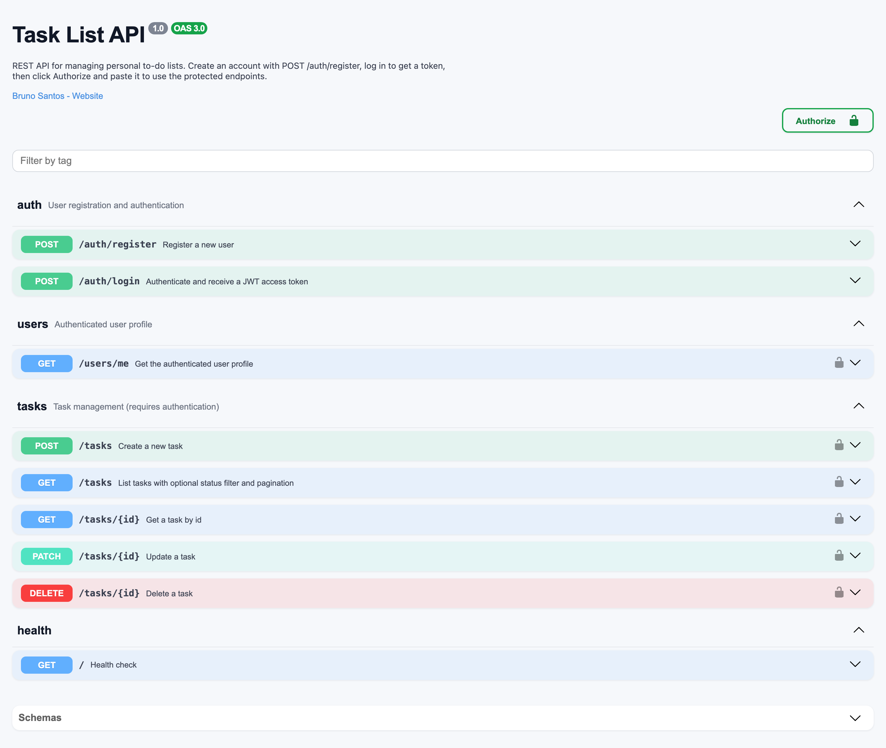
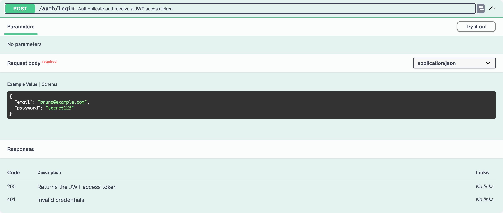

# Task List API

A REST API for managing personal to-do lists, built with NestJS, Prisma and SQLite.

I built this project to practice what a real backend needs beyond the basic CRUD: authentication, data isolation between users, request validation, automated tests and proper API documentation.

[](https://nestjs.com/)
[](https://www.typescriptlang.org/)
[](https://www.prisma.io/)
[](LICENSE)

## What it does

Users create an account and log in to receive a JWT token. With that token they can manage their own task list: create tasks, list them with status filters and pagination, update and delete. A user can never see or touch another user's tasks — the API returns 404 even if the task id exists.

Tasks move between three statuses: `PENDING`, `IN_PROGRESS` and `DONE`.

## Documentation

The whole API is documented with Swagger. Run the project and open `http://localhost:3000/docs`:



Log in through `POST /auth/login`, copy the `accessToken` and click the Authorize button to use the protected endpoints directly from the browser:



## Endpoints

| Method | Route | Description | Auth |
|--------|-------|-------------|------|
| GET | `/` | Health check | No |
| POST | `/auth/register` | Create an account | No |
| POST | `/auth/login` | Log in and receive a JWT | No |
| GET | `/users/me` | Current user profile | Yes |
| POST | `/tasks` | Create a task | Yes |
| GET | `/tasks` | List tasks (`?status=&page=&limit=`) | Yes |
| GET | `/tasks/:id` | Get a task | Yes |
| PATCH | `/tasks/:id` | Update a task | Yes |
| DELETE | `/tasks/:id` | Delete a task | Yes |

Example with curl:

```bash
# create an account
curl -X POST http://localhost:3000/auth/register \
  -H 'Content-Type: application/json' \
  -d '{"name":"Bruno","email":"bruno@example.com","password":"secret123"}'

# log in
TOKEN=$(curl -s -X POST http://localhost:3000/auth/login \
  -H 'Content-Type: application/json' \
  -d '{"email":"bruno@example.com","password":"secret123"}' | jq -r .accessToken)

# create and list tasks
curl -X POST http://localhost:3000/tasks \
  -H "Authorization: Bearer $TOKEN" \
  -H 'Content-Type: application/json' \
  -d '{"title":"Buy groceries"}'

curl http://localhost:3000/tasks -H "Authorization: Bearer $TOKEN"
```

## How the data is organized

The database has only two tables. A `users` table with name, unique email and the bcrypt-hashed password, and a `tasks` table where each task has a title, an optional description and a status. Every task belongs to a user, and deleting a user removes their tasks along with it. Nothing more than the project actually needs.

## Running locally

You only need Node.js 20+. I chose SQLite on purpose so the project runs with zero setup — no Docker, no database server.

```bash
git clone https://github.com/imbrunosantoos/api-lista-tarefas.git
cd api-lista-tarefas
npm install

cp .env.example .env   # set your own JWT_SECRET

npx prisma migrate dev
npm run start:dev
```

The API starts at `http://localhost:3000` and the docs at `http://localhost:3000/docs`.

| Variable | Description | Default |
|----------|-------------|---------|
| `DATABASE_URL` | SQLite connection string | `file:./dev.sqlite` |
| `JWT_SECRET` | Secret used to sign tokens | required |
| `JWT_EXPIRES_IN` | Token lifetime | `1d` |
| `PORT` | HTTP port | `3000` |

## Tests

There are 22 end-to-end tests covering registration, login, the whole task CRUD and the edge cases that matter: invalid payloads, missing tokens, duplicated emails and one user trying to access another user's tasks. They run against a separate SQLite database that is recreated on every run.

```bash
npm test          # unit tests
npm run test:e2e  # end-to-end tests
```

## Stack

- [NestJS](https://nestjs.com/) with TypeScript
- [Prisma](https://www.prisma.io/) as the ORM, with SQLite
- [Passport](https://www.passportjs.org/) + JWT for authentication, bcrypt for password hashing
- class-validator for request validation
- Swagger (OpenAPI) for documentation
- Jest + Supertest for the test suite

## Project structure

```
src/
├── auth/          # register, login, JWT strategy and guard
├── users/         # user service and profile endpoint
├── tasks/         # task CRUD: controller, service, DTOs
├── prisma/        # PrismaService + global module
├── app.module.ts
└── main.ts        # bootstrap, validation pipe, Swagger setup
prisma/            # schema and migrations
test/              # e2e suites (auth, users, tasks)
```

## License

[MIT](LICENSE) — Bruno Santos
