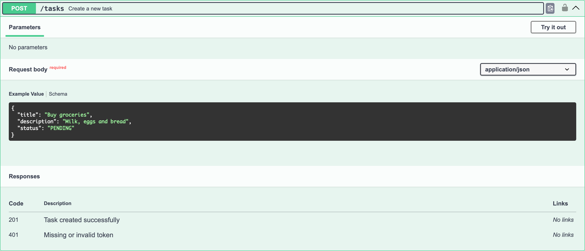
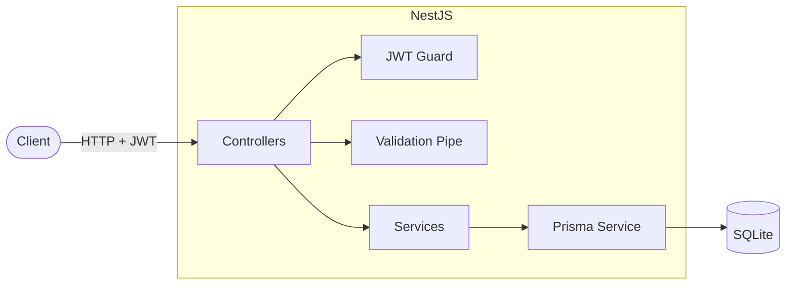
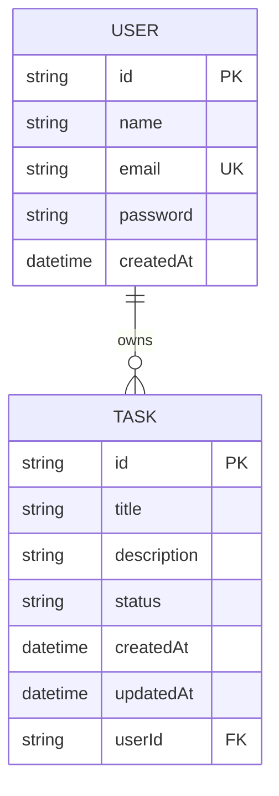

<div align="center">

# ✅ Task List API

**A RESTful task management API with JWT authentication, built with NestJS + Prisma.**

[](https://nestjs.com/)
[](https://www.typescriptlang.org/)
[](https://www.prisma.io/)
[](https://www.sqlite.org/)
[](https://jwt.io/)
[](LICENSE)

[Features](#-features) · [API Docs](#-api-documentation) · [Endpoints](#-endpoints) · [Getting Started](#-getting-started) · [Testing](#-testing)

</div>

---

## 📸 API Documentation

Interactive Swagger documentation is available at **`/docs`** when the server is running.


<details>
<summary><strong>🔑 POST /auth/login — request example</strong></summary>


</details>

<details>
<summary><strong>📝 POST /tasks — create task example</strong></summary>



</details>

## ✨ Features

- 🔐 **JWT authentication** — register and log in with bcrypt-hashed passwords
- 📋 **Full task CRUD** — create, list, view, update and delete tasks
- 👤 **Per-user data isolation** — users can only see and manage their own tasks
- 🔎 **Filtering & pagination** — filter tasks by status, paginate results
- ✅ **Request validation** — strict DTO validation with `class-validator` (unknown fields rejected)
- 📚 **Swagger / OpenAPI** — interactive documentation with bearer-token support
- 🧪 **E2E test suite** — 22 tests covering auth, users and tasks with an isolated test database

## 🏗️ Architecture



### Data model



Task status is one of `PENDING` · `IN_PROGRESS` · `DONE`.

## 🔗 Endpoints

| Method | Route | Description | Auth |
|--------|-------|-------------|:----:|
| `GET` | `/` | Health check | — |
| `POST` | `/auth/register` | Register a new user | — |
| `POST` | `/auth/login` | Log in and receive a JWT | — |
| `GET` | `/users/me` | Get the authenticated user profile | 🔒 |
| `POST` | `/tasks` | Create a task | 🔒 |
| `GET` | `/tasks` | List tasks (`?status=&page=&limit=`) | 🔒 |
| `GET` | `/tasks/:id` | Get a task by id | 🔒 |
| `PATCH` | `/tasks/:id` | Update a task | 🔒 |
| `DELETE` | `/tasks/:id` | Delete a task | 🔒 |

<details>
<summary><strong>Example flow with curl</strong></summary>

```bash
# 1. Register
curl -X POST http://localhost:3000/auth/register \
  -H 'Content-Type: application/json' \
  -d '{"name":"Bruno","email":"bruno@example.com","password":"secret123"}'

# 2. Log in and grab the token
TOKEN=$(curl -s -X POST http://localhost:3000/auth/login \
  -H 'Content-Type: application/json' \
  -d '{"email":"bruno@example.com","password":"secret123"}' | jq -r .accessToken)

# 3. Create a task
curl -X POST http://localhost:3000/tasks \
  -H "Authorization: Bearer $TOKEN" \
  -H 'Content-Type: application/json' \
  -d '{"title":"Buy groceries","description":"Milk and eggs"}'

# 4. List tasks
curl "http://localhost:3000/tasks?status=PENDING&page=1&limit=10" \
  -H "Authorization: Bearer $TOKEN"
```

</details>

## 🚀 Getting Started

### Prerequisites

- [Node.js](https://nodejs.org/) 20+
- npm

### Installation

```bash
# 1. Clone the repository
git clone https://github.com/imbrunosantoos/api-lista-tarefas.git
cd api-lista-tarefas

# 2. Install dependencies
npm install

# 3. Configure environment variables
cp .env.example .env
# then edit .env and set a strong JWT_SECRET

# 4. Create the database and run migrations
npx prisma migrate dev

# 5. Start the server
npm run start:dev
```

The API is now running at `http://localhost:3000` and the Swagger docs at `http://localhost:3000/docs`. 🎉

### Environment variables

| Variable | Description | Default |
|----------|-------------|---------|
| `DATABASE_URL` | SQLite connection string | `file:./dev.sqlite` |
| `JWT_SECRET` | Secret used to sign JWTs | — (required) |
| `JWT_EXPIRES_IN` | Token lifetime | `1d` |
| `PORT` | HTTP port | `3000` |

## 🧪 Testing

```bash
# Unit tests
npm test

# E2E tests (runs against an isolated SQLite test database)
npm run test:e2e
```

## 📁 Project Structure

```
src/
├── auth/          # Registration, login, JWT strategy and guard
│   └── dto/       # Register / login DTOs
├── users/         # User service and profile endpoint
├── tasks/         # Task CRUD: controller, service, DTOs
│   └── dto/       # Create / update / query DTOs
├── prisma/        # PrismaService + global PrismaModule
├── app.module.ts  # Root module
└── main.ts        # Bootstrap, validation pipe, Swagger setup
prisma/
├── schema.prisma  # Data models (User, Task)
└── migrations/    # Database migrations
test/              # E2E test suites (auth, users, tasks)
```

## 🛠️ Tech Stack

| Layer | Technology |
|-------|------------|
| Framework | [NestJS](https://nestjs.com/) 11 |
| Language | [TypeScript](https://www.typescriptlang.org/) 5 |
| ORM | [Prisma](https://www.prisma.io/) 6 |
| Database | [SQLite](https://www.sqlite.org/) |
| Auth | [Passport](https://www.passportjs.org/) + JWT + [bcrypt](https://github.com/kelektiv/node.bcrypt.js) |
| Validation | [class-validator](https://github.com/typestack/class-validator) / [class-transformer](https://github.com/typestack/class-transformer) |
| Docs | [Swagger / OpenAPI](https://swagger.io/) |
| Tests | [Jest](https://jestjs.io/) + [Supertest](https://github.com/ladjs/supertest) |

## 📄 License

This project is licensed under the [MIT License](LICENSE).

---

<div align="center">

Made with ☕ by **[Bruno Santos](https://github.com/imbrunosantoos)**

</div>
